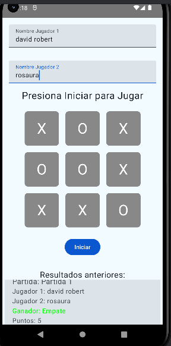

# Juego 3 en Raya

Este proyecto implementa el juego clásico de 3 en raya (Tic-Tac-Toe), desarrollado en **Kotlin** utilizando el patrón de arquitectura **MVVM** (Model-View-ViewModel). La aplicación guarda los resultados de las partidas en una base de datos local utilizando **Room**. La finalidad del proyecto es mostrar cómo una aplicación estructurada bajo el patrón MVVM mejora la mantenibilidad y escalabilidad del código.

## Tabla de Contenidos

1. [Introducción](#introducción)
2. [Arquitectura del Sistema](#arquitectura-del-sistema)
3. [Estructura del Proyecto](#estructura-del-proyecto)
4. [Detalles de los Componentes](#detalles-de-los-componentes)
5. [Cómo Configurar y Ejecutar el Proyecto](#cómo-configurar-y-ejecutar-el-proyecto)
6. [Características Principales](#características-principales)
7. [Diagrama de la Arquitectura](#diagrama-de-la-arquitectura)
8. [Contribuciones](#contribuciones)
## Imágenes del Proyecto

A continuación se presentan algunas imágenes relevantes del proyecto:

### Ejemplo 1


---

### Ejemplo 2


---

### Ejemplo 3




---

## Introducción

El propósito de este proyecto es desarrollar una aplicación sencilla de un **juego de 3 en raya** con enfoque en la separación de responsabilidades y buenas prácticas utilizando la arquitectura **MVVM**. El patrón MVVM permite una clara distinción entre la capa de datos (modelo), la interfaz gráfica (vista) y la lógica de negocio (ViewModel), lo que facilita el mantenimiento y la escalabilidad del código.

La aplicación cuenta con un sistema de persistencia utilizando **Room**, una librería de persistencia de datos local, para guardar los resultados de las partidas y poder consultarlos posteriormente. Además, se implementa un sistema de comunicación con un backend utilizando **Retrofit**, que permite almacenar y recuperar los resultados de las partidas en una base de datos MySQL a través de un servidor Node.js. Esta integración proporciona una experiencia más completa, permitiendo a los jugadores acceder a sus estadísticas de juego de manera efectiva y en tiempo real.

---

## Arquitectura del Sistema

La aplicación sigue el patrón de diseño **MVVM (Model-View-ViewModel)**, que se descompone en tres componentes principales:

- **Model (Modelo)**: Responsable de la gestión de los datos. Incluye las clases para la base de datos, los DAO (Data Access Objects) y las entidades que representan los datos, en este caso, los resultados de las partidas. Utiliza **Room** para la persistencia local de datos.

- **View (Vista)**: Se encarga de la interfaz de usuario. Esta capa incluye el código que genera la UI del juego, como el tablero de 3 en raya y las interacciones de los jugadores con el juego. Está implementada utilizando **Jetpack Compose** para una construcción moderna de interfaces.

- **ViewModel**: Actúa como intermediario entre la vista y el modelo. Gestiona la lógica de negocio, actualiza la vista y se comunica con el repositorio para obtener y almacenar los datos. Utiliza **LiveData** y **Coroutines** para gestionar cambios en los datos de forma reactiva y asíncrona.

La aplicación también integra un backend utilizando **Retrofit**, lo que permite almacenar y recuperar los resultados de las partidas en una base de datos MySQL a través de un servidor Node.js, enriqueciendo así la experiencia del usuario.


### Ejemplo


---

## Estructura del Proyecto

El proyecto está organizado en las siguientes carpetas y archivos:

```plaintext
main/
  └── java/
      └── pe.edu.upeu.juego3enraya/
          ├── model/                       // Modelo de datos y configuración de Room
          │    ├── AppDatabase.kt           // Configuración de la base de datos de Room
          │    ├── GameResult.kt            // Clase de datos para los resultados del juego
          │    └── GameResultDao.kt         // DAO para acceder a la base de datos de Room
          ├── repository/                   // Lógica de acceso a datos
          │    └── GameResultRepository.kt   // Repositorio que gestiona la persistencia local y la comunicación con el backend
          ├── network/                      // Comunicación con el backend
          │    ├── GameResultApi.kt         // Definición de la API de Retrofit
          │    └── RetrofitInstance.kt       // Configuración de Retrofit para las solicitudes HTTP
          ├── ui/                           // Interfaz de usuario
          │    ├── view/                    // Pantallas de la aplicación
          │    │    └── TicTacToeScreen.kt  // Pantalla principal del juego
          │    └── theme/                   // Definición de temas y estilos
          ├── viewmodel/                    // Lógica de presentación
          │    ├── TicTacToeViewModel.kt    // ViewModel que gestiona la lógica del juego
          │    └── TicTacToeViewModelFactory.kt // Factory para crear instancias de ViewModel
          └── MainActivity.kt                // Actividad principal que inicia la aplicación

```


---
## Detalles de los Componentes

### 1. **Model**
   - **`GameResult.kt`**: Representa la entidad que guarda el resultado de una partida. Esta clase define los campos que se almacenan en la base de datos, como los jugadores y el resultado del juego.
   - **`GameResultDao.kt`**: Es la interfaz de acceso a los datos. Define los métodos de consulta y almacenamiento de los resultados en la base de datos. Utiliza anotaciones de Room para realizar operaciones de CRUD (Create, Read, Update, Delete).
   - **`AppDatabase.kt`**: Configura la base de datos utilizando Room. Define la instancia de la base de datos y conecta el DAO (`GameResultDao`) con la aplicación.

### 2. **Repository**
   - **`GameResultRepository.kt`**: Gestiona la lógica de acceso a los datos. Interactúa con el DAO para obtener los resultados de las partidas y exponerlos al ViewModel. El repositorio es el responsable de decidir de dónde provienen los datos (base de datos local con Room o red mediante Retrofit).

### 3. **Network**
   - **`GameResultApi.kt`**: Define las operaciones de la API para interactuar con el backend. Utiliza Retrofit para realizar solicitudes HTTP para guardar y recuperar los resultados de las partidas.
   - **`RetrofitInstance.kt`**: Configura la instancia de Retrofit que se utiliza para realizar las solicitudes a la API del backend.

### 4. **View**
   - **`TicTacToeScreen.kt`**: Representa la interfaz gráfica del juego de 3 en raya. Muestra el tablero y gestiona la interacción con el usuario. Se comunica con el ViewModel para obtener el estado del juego y actualizar la UI.
   - **`MainActivity.kt`**: La actividad principal de la aplicación que aloja la vista del juego y configura el ViewModel.

### 5. **ViewModel**
   - **`TicTacToeViewModel.kt`**: Gestiona la lógica del juego de 3 en raya. Controla el flujo de la partida, valida las jugadas y actualiza el estado de la vista. Se comunica con el repositorio para almacenar los resultados de las partidas.
   - **`TicTacToeViewModelFactory.kt`**: Proporciona una instancia de `TicTacToeViewModel` cuando se necesita. Esto es útil para inyectar dependencias en el ViewModel, como el repositorio.

---

## Cómo Configurar y Ejecutar el Proyecto

### Prerrequisitos

1. **Android Studio**: Instala la última versión.
2. **Kotlin**: Este proyecto está escrito en Kotlin.
3. **Room**: Librería utilizada para la persistencia de datos local.
4. **Retrofit**: Librería utilizada para la comunicación con el backend a través de HTTP.

### Pasos para Ejecutar el Proyecto

1. **Clonar el repositorio**:
   ```bash
   git clone https://github.com/yucramamanidavid/Juego3EnRaya.git

2. **Abrir el proyecto en Android Studio**:  
   Clona este repositorio o descarga el código fuente y ábrelo en Android Studio.

3. **Sincronizar dependencias**:  
   Ve a `Build` > `Sync Project with Gradle Files` para sincronizar todas las dependencias necesarias del proyecto.

4. Configurar el backend:
  Asegúrate de que el servidor **Node.js** esté corriendo y que la base de datos MySQL esté configurada en Laragon. Si es necesario, ajusta la URL en RetrofitInstance.kt para que apunte a http://10.0.2.2:3000/ si estás utilizando un emulador.

6. **Ejecutar la aplicación**:  
   Una vez sincronizado el proyecto, puedes ejecutarlo en un emulador o en un dispositivo físico conectado. Para hacerlo, selecciona el dispositivo en la barra superior de Android Studio y haz clic en el botón `Run` o presiona `Shift + F10`.

---
## Características Principales

- **Juego Local de 3 en Raya**: Permite que dos jugadores compitan en una partida local, proporcionando una experiencia de juego interactiva y entretenida.

- **Persistencia de Datos**: Los resultados de cada partida se guardan en una base de datos local utilizando **Room**, lo que permite consultar y visualizar el historial de partidas en cualquier momento.

- **Arquitectura MVVM**: El proyecto sigue la arquitectura **MVVM** (Model-View-ViewModel) para separar la lógica de negocio, la interfaz gráfica y la gestión de datos. Esto facilita el mantenimiento y la escalabilidad del código.

- **Comunicación con Backend**: Utiliza **Retrofit** para interactuar con un servidor Node.js, permitiendo almacenar y recuperar los resultados de las partidas en una base de datos MySQL, lo que enriquece la experiencia del usuario.

- **Tema Personalizado**: La aplicación cuenta con un tema definido en la carpeta `theme`, lo que permite un diseño consistente y atractivo en toda la interfaz de usuario.

---
## Diagrama de la Arquitectura

El siguiente diagrama muestra la arquitectura del sistema basada en MVVM (Model-View-ViewModel):


## Contribuciones
-**Rosaura**: MainActivity.kt, GameResult.kt, TicTacToeViewModelFactory.kt
--
-**David**: GameResultDao.kt, GameResultRepository.kt, TicTacToeViewModel.kt, AppDatabase.kt, TicTacToeScreen.kt, Network, GameResultApi, RetrofitInstance
--
-**Mykol**: TicTacToeScreen.kt, MainActivity.kt, PdfExporter.kt, TicTacToeViewModel.kt, file_paths.xml, Theme.kt
--

